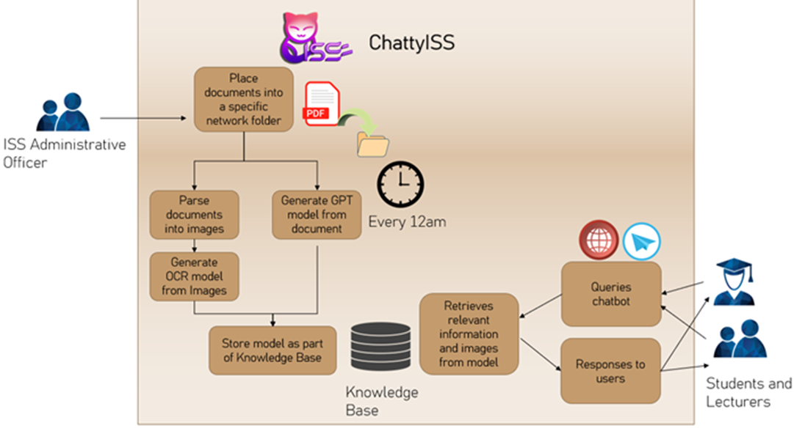

---

## SECTION 1 : PROJECT TITLE
## ChattyISS - Improved NUS-ISS Chatbot
---

## SECTION 2 : EXECUTIVE SUMMARY / PAPER ABSTRACT

The current NUS-ISS website is targeted at prospective students rather than existing students. It is difficult to search for related information and data pertaining to non-curriculum (such as nearest canteen, nearest facilities) or student guides (student handbooks).  
 It has been identified that there are already existing NUS-ISS chatbots developed. These NUS-ISS chatbots cannot provide accurate responses to queries and are confined to fixed responses. They only accept limited follow-up questions. These chatbots are also outdated and do not provide easy means for extension. Frequent changes to the NUS-ISS curriculum or information could not be easily updated into the chat system.  
In summary, the problems of existing solutions can be summarised in the following points
•	Relevancy of information
•	Difficulty of updating information

The proposed intelligent chatbot is going to address these gaps of the current NUS-ISS chatbots. The delivery of the MVP (Minimum Viable Prototype) is going to demonstrate the chatbot’s capability of delivering accurate and up-to-date information. 
 The following diagram illustrates the business flow for the proposed solution. 

---

## SECTION 3 : CREDITS / PROJECT CONTRIBUTION

| Official Full Name  | Student ID (MTech Applicable)  | Work Items (Who Did What) | Email (Optional) |
| :------------ |:---------------:| :-------------------------| :-----|
| Lee Kah Wai | A0019705H | *	Project coordinator for project. *	Distribution of work to team *	Work on assessment, development of frontend system *	Work on assessment, development of endpoint system *	System integration for the System *	Host application on Azure *	Creation of Business Video| e1111840@u.nus.edu |
| Wee De Li, Darren | A0269370X |  * Technical manager for project * Responsible for all technical aspects and modelling.  * Researching and selecting various packages and methodologies to develop a chatbot  * Design and implement LangChain * Conduct testing to ensure the accuracy of our chatbot  * Identify necessary improvements to enhance system performance.| e1112241@u.nus.edu |
| Seow Teck Han, Michael | A0270178B |  *	Business Manager for this project *	Conduct market research on the viability of chatbot systems. *	Research and testing on image recognition solutions  *	Design and develop the image processing subsystem. *	In charge of design and planning of test cases  *	Conduct testing of chatbot system functionalities. *	Summarize the objectives and goals of the project into a conclusion.| e1117140@u.nus.edu |
| Sankalp | A0226756W |  *	Release manager for the project *	Worked on creating and maintaining the GitHub repository *	Researched on large language models to use for question answering. *	Researched on technologies to use for the frontend/backend. *	Created the template for the final report. *	Created the technical video for the project.| sankalp@u.nus.edu |

---

## SECTION 4 : VIDEO OF SYSTEM MODELLING & USE CASE DEMO

//TODO

---

## SECTION 5 : USER GUIDE

//TODO

---
## SECTION 6 : PROJECT REPORT / PAPER

//TODO

**Recommended Sections for Project Report / Paper:**
- Executive Summary / Paper Abstract
- Sponsor Company Introduction (if applicable)
- Business Problem Background
- Market Research
- Project Objectives & Success Measurements
- Project Solution (To detail domain modelling & system design.)
- Project Implementation (To detail system development & testing approach.)
- Project Performance & Validation (To prove project objectives are met.)
- Project Conclusions: Findings & Recommendation
- Appendix of report: Project Proposal
- Appendix of report: Mapped System Functionalities against knowledge, techniques and skills of modular courses: MR, RS, CGS
- Appendix of report: Installation and User Guide
- Appendix of report: 1-2 pages individual project report per project member, including: Individual reflection of project journey: (1) personal contribution to group project (2) what learnt is most useful for you (3) how you can apply the knowledge and skills in other situations or your workplaces
- Appendix of report: List of Abbreviations (if applicable)
- Appendix of report: References (if applicable)

---
## SECTION 7 : MISCELLANEOUS

//TODO

---
