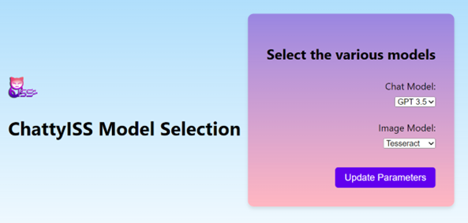

---

## SECTION 1 : PROJECT TITLE
## ChattyISS - Improved NUS-ISS Chatbot
---

## SECTION 2 : EXECUTIVE SUMMARY / PAPER ABSTRACT

The current NUS-ISS website is targeted at prospective students rather than existing students. It is difficult to search for related information and data pertaining to non-curriculum (such as nearest canteen, nearest facilities) or student guides (student handbooks).  
 It has been identified that there are already existing NUS-ISS chatbots developed. These NUS-ISS chatbots cannot provide accurate responses to queries and are confined to fixed responses. They only accept limited follow-up questions. These chatbots are also outdated and do not provide easy means for extension. Frequent changes to the NUS-ISS curriculum or information could not be easily updated into the chat system.  
In summary, the problems of existing solutions can be summarised in the following points
•	Relevancy of information
•	Difficulty of updating information

The proposed intelligent chatbot is going to address these gaps of the current NUS-ISS chatbots. The delivery of the MVP (Minimum Viable Prototype) is going to demonstrate the chatbot’s capability of delivering accurate and up-to-date information. 
 The following diagram illustrates the business flow for the proposed solution. 


---

## SECTION 3 : CREDITS / PROJECT CONTRIBUTION

| Official Full Name  | Student ID (MTech Applicable)  | Work Items (Who Did What) | Email (Optional) |
| :------------ |:---------------:| :-------------------------| :-----|
| Lee Kah Wai | A0019705H | *	Project coordinator for project.<br>*	Distribution of work to team<br>*	Work on assessment, development of frontend system<br>*	Work on assessment, development of endpoint system<br>*	System integration for the System<br>*	Host application on Azure<br>*	Creation of Business Video| e1111840@u.nus.edu |
| Wee De Li, Darren | A0269370X | <br>* Technical manager for project<br>* Responsible for all technical aspects and modelling. <br>* Researching and selecting various packages and methodologies to develop a chatbot <br>* Design and implement LangChain<br>* Conduct testing to ensure the accuracy of our chatbot <br>* Identify necessary improvements to enhance system performance.| e1112241@u.nus.edu |
| Seow Teck Han, Michael | A0270178B | <br>*	Business Manager for this project<br>*	Conduct market research on the viability of chatbot systems.<br>*	Research and testing on image recognition solutions <br>*	Design and develop the image processing subsystem.<br>*	In charge of design and planning of test cases <br>*	Conduct testing of chatbot system functionalities.<br>*	Summarize the objectives and goals of the project into a conclusion.| e1117140@u.nus.edu |
| Sankalp | A0226756W | <br>*	Release manager for the project<br>*	Worked on creating and maintaining the GitHub repository<br>*	Researched on large language models to use for question answering.<br>*	Researched on technologies to use for the frontend/backend.<br>*	Created the template for the final report.<br>*	Created the technical video for the project.| sankalp@u.nus.edu |

---

## SECTION 4 : VIDEO OF SYSTEM MODELLING & USE CASE DEMO

### Business Presentation
[](https://youtu.be/3BicvaHyMQU)
<br>

### Technical Presentation
[](https://youtu.be/1UdpvNYcKI4)
<br>

---

## SECTION 5 : USER GUIDE

### Server Installation and Setup
#### Installation setup
ChattyISS is already hosted in Azure. However, it is possible to install and run in your local machine. 
Use an Ubuntu machine or WSL. Ensure that Python3 has been installed in the machine. 
Download the latest code from Github 
Navigate to /SystemCode/backend/endpoint folder
 
Download all the necessary requirements by running the following command. 
chmod +x install.sh

```./install.sh```

Setup a cron task to perform daily OCR. 
```
chmod +x cronTask.sh
crontab –e
```


This will open a table in the default text editor. Add a new line at the bottom of the file and specify the schedule and command to execute.
```
0 0 * * * cronTask.sh
```

##### Backend Service
Retrieve your OpenAI API key from 
https://platform.openai.com/account/api-keys
Navigate to /SystemCode/backend/endpoint/NUS_ISS_chatbot folder
Edit chatbot.py, chatbot_gpt4.py and understandingimages_llama.py with your API key.

```
import os
os.environ[“OPENAI_API_KEY”] = {Your API Key}
```
Navigate to /SystemCode/backend/endpoint/ folder.
 Run the backend server using the following command.
 ```
python3 main2.py
```

Verify that the backend server is running by navigating to the link in your preferred web browser as shown above. 
The following webpage should be shown:
<brr>
 

---
## SECTION 6 : PROJECT REPORT / PAPER

The project report could be found in the ProjectReport folder in this repository. 


